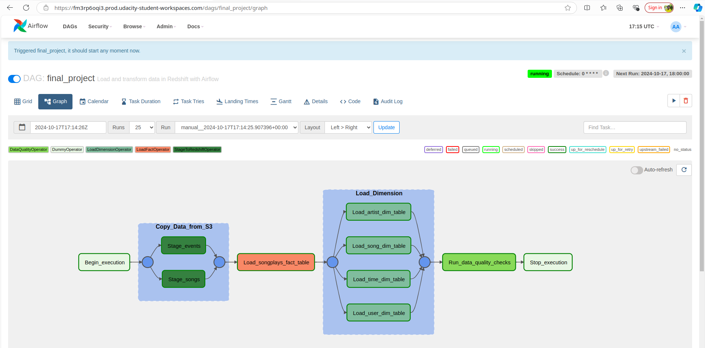

# Data Pipelines with Airflow

## Project Overview

This project involves building an ETL pipeline using **Apache Airflow** to automate data loading and transformation tasks for Sparkify, a music streaming company. The pipeline ingests user activity logs and song metadata stored in **AWS S3**, transforms it, and loads it into **Amazon Redshift**. This allows Sparkify to efficiently analyze user behavior and song metadata with minimal manual intervention.

## Project Details

The data pipeline is designed to process two JSON datasets:
- **Log Data**: User activity logs in the app, detailing actions and interactions.
- **Song Data**: Metadata about songs available on the platform.

Both datasets are initially stored in **S3** and are transferred to Redshift where they are transformed into a star schema. This star schema consists of fact and dimension tables, allowing Sparkify’s data analysts to perform optimized queries for reporting and analysis.

## Requirements

To accomplish the project goals, the following steps are required:

### Datasets
- Log data: `s3://udacity-dend/log_data`
- Song data: `s3://udacity-dend/song-data`

### ETL Pipeline

1. **Setup S3 Buckets and Copy Data**:
   - Create an S3 bucket to copy Udacity’s dataset and simulate Sparkify’s data storage.
   - Copy log and song data from Udacity's S3 bucket into your own bucket for processing.

2. **DAG and Task Configuration**:
   - Implement an Airflow **DAG** to manage the ETL pipeline. Configure the DAG with:
     - No dependencies on past runs
     - Three retry attempts on task failure, with a 5-minute interval
     - Catchup turned off
     - No email notifications on retries
   - Define task dependencies according to the specified flow, ensuring that tasks are executed in the correct sequence.

3. **Custom Operators**:
   - **Stage Operator**: Loads JSON data from S3 to Redshift tables. The operator uses templated fields to allow dynamic loading based on timestamps, enabling backfills.
   - **Fact and Dimension Operators**: Load data into Redshift fact and dimension tables. Dimensions use a truncate-insert pattern, while fact tables are append-only.
   - **Data Quality Operator**: Runs data quality checks post-load to ensure data integrity, raising an exception if quality criteria are not met.

4. **Data Quality Checks**:
   - Define SQL-based tests to validate data. For example, a test may check if certain columns have NULL values or if the table row count matches expectations.

## DAG Flow

The DAG flow is as follows:

1. **Begin_execution** - Starts the pipeline.
2. **Stage_events** and **Stage_songs** - Stage JSON data into Redshift.
3. **Load_songplays_fact_table** - Load transformed data into the fact table.
4. **Load_artist_dim_table**, **Load_song_dim_table**, **Load_time_dim_table**, and **Load_user_dim_table** - Populate dimension tables.
5. **Run_data_quality_checks** - Run data quality checks on the transformed data.
6. **Stop_execution** - Finalizes the DAG.

## Project Files

- [**final_project.py**](dag/final_project.py): Contains the DAG definition and task dependencies.
- [**state_redshift.py**](plugins/final_project_operators/stage_redshift.py): Operator to stage data from S3 to Redshift.
- [**load_fact.py**](plugins/final_project_operators/load_fact.py): Operator to load data into the fact table.
- [**load_dimension.py**](plugins/final_project_operators/load_dimemsion.py): Operator to load data into dimension tables.
- [**data_quality.py**](plugins/final_project_operators/data_quality.py): Operator to run data quality checks.
- [**final_project_sql_statements.py**](udacity/common/final_project_sql_statements.py): Contains SQL queries for ETL and data transformations.

## Getting Started

To replicate this project, you will need access to an **AWS environment** with **S3**, **Redshift**, and **Airflow**.

1. **Setup the Environment**:
   - Install Airflow and configure AWS credentials.
   - Set up connections in Airflow for AWS and Redshift.
   
2. **Load Data**:
   - Copy the data from Udacity’s S3 bucket to your own S3 bucket as per instructions.

3. **Run the DAG**:
   - Start the Airflow web server and trigger the DAG from the Airflow UI.
   - Monitor task execution, and inspect logs for any errors or data quality failures.

4. **Validate Data**:
   - Confirm data has been loaded successfully in Redshift by running SQL queries on the tables.

## Technologies Used

- **Apache Airflow**: Pipeline orchestration and automation.
- **AWS S3**: Storage for input datasets.
- **Amazon Redshift**: Data warehouse for storing and querying transformed data.
- **Python**: For scripting custom operators and SQL transformations.

## License

This project is licensed under the MIT License - see the LICENSE file for details.
