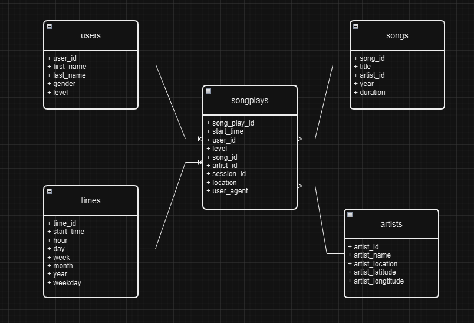

# Project: Cloud Data Warehouse

## 1. Introduction

Sparkify, a music streaming startup, has grown its user base and song database significantly. To scale efficiently, they aim to move their processes and data to the cloud. The data resides in S3, containing JSON logs on user activity and JSON metadata on the songs in their app. As their data engineer, your task is to build an ETL pipeline that extracts data from S3, stages it in Redshift, and transforms it into a set of dimensional tables for the analytics team to gain insights into user listening behavior.

## 2. Data Flow

- **Data Sources**: The project uses song data and log files stored in an S3 bucket, accessible via:
  - `s3://udacity-dend/song_data`
  - `s3://udacity-dend/log_data`
  - Metadata file for log data: `s3://udacity-dend/log_json_path.json`
- **ETL Process**: Data is extracted from the source, loaded into staging tables in Redshift, and then transformed into analytics tables.

## 3. Database Design

### Staging Tables:
- **staging_events**: Stores JSON log file data.
- **staging_songs**: Stores song information from the JSON files.

### Analytics Tables:
- **songplays** (Fact Table): Stores event information about songs being played.
- **users** (Dimension Table): Stores user information.
- **songs** (Dimension Table): Stores song information.
- **artists** (Dimension Table): Stores artist information.
- **times** (Dimension Table): Stores timestamps of records in songplays.

## 4. File Descriptions

- **sql_queries.py**: Contains all raw SQL queries.
- **create_tables.py**: Drops existing tables (if any) and creates new tables.
- **etl.py**: Copies data from log and JSON files in S3 into staging tables, then inserts data into fact and dimension tables.
- **dwh.cfg**: Configuration file storing cloud environment information.

## 5. How to Run the Project

1. **Install Required Packages**:
   - `psycopg2`
   - `configparser`
2. **Create Tables**:
   - Run `create_tables.py` to create staging and analytics tables.
3. **Run ETL Process**:
   - Execute `etl.py` to populate all tables with data.